<div align="center">

<!-- BANNER ANIMADO COM TYPING EFFECT -->


<!-- TYPING ANIMATION -->
<a href="https://git.io/typing-svg"></a>

</div>

---

## 🎯 Sobre Mim

```python
class GabrielAraujo:
    def __init__(self):
        self.username = "Gabriel-Ctrl"
        self.role = "RPA & Python Developer"
        self.location = "Brasil 🇧🇷"
        self.code_languages = ["Python", "HTML", "CSS", "JavaScript"]
        self.tools = ["Git", "VS Code", "UiPath", "Automation"]
        self.current_focus = "Automação de Processos"
        
    def say_hi(self):
        print("Obrigado por visitar meu perfil! Vamos criar algo incrível juntos!")

me = GabrielAraujo()
me.say_hi()
```

<div align="center">

## 🛠️ Tecnologias & Ferramentas


</div>

---

## 📊 Estatísticas GitHub

<div align="center">
  
  
</div>

<div align="center">
  
  
  
</div>

---

## 🏆 GitHub Troféus

<div align="center">
  
  
  
</div>

---

## 🌟 Projetos em Destaque

<div align="center">

[](https://github.com/Gabriel-Ctrl/ct-redes)
[](https://github.com/Gabriel-Ctrl/Projeto-mqtt-Gabriel)

</div>

---

## 📈 Gráfico de Contribuições

<div align="center">
  
  
  
</div>

---

## 💼 Experiência

```yaml
experiência:
  - role: "RPA & Python Developer"
    empresa: "XXXXXXX"
    período: "2021 - "XXXXX"
    skills:
      - Automação de processos
      - Web scraping
      - Desenvolvimento de bots
      - Análise de dados
    
  - role: "Desenvolvedor Full Stack"
    empresa: "Projetos Pessoais"
    período: "2022 - Presente"
    skills:
      - HTML/CSS/JavaScript
      - Python Backend
      - Git & GitHub
      - APIs REST
```

---

## 🎓 Aprendendo Atualmente

```mermaid
mindmap
  root((Gabriel))
    Automação
      RPA
      Python Bots
      Web Scraping
    Backend
      FastAPI
      Flask
      Django
    DevOps
      Docker
      CI/CD
      Linux
    Dados
      Pandas
      SQL
      Data Analysis
```

<div align="center">



</div>

---

## 📫 Como me encontrar

<div align="center">

[](https://www.linkedin.com/in/gabriel-araujo-da-silva-/))
[](araujo.gabrielsilva2@gmail.com)
[](https://github.com/Gabriel-Ctrl)

</div>

---

## 💡 Frase Motivacional

<div align="center">


</div>

---

## 📊 Tempo de Código (Última Semana)

<!--START_SECTION:waka-->
<!--END_SECTION:waka-->

---

## 🎮 Quando não estou codando...

<div align="center">

🎵 Ouvindo música | 🎮 Jogando | 📚 Lendo | ☕ Tomando café

</div>

---

<div align="center">

### 💬 "Code is like humor. When you have to explain it, it's bad." – Cory House

### ⭐ Se você gostou dos meus projetos, deixe uma estrela!

### 👀 

</div>

---


